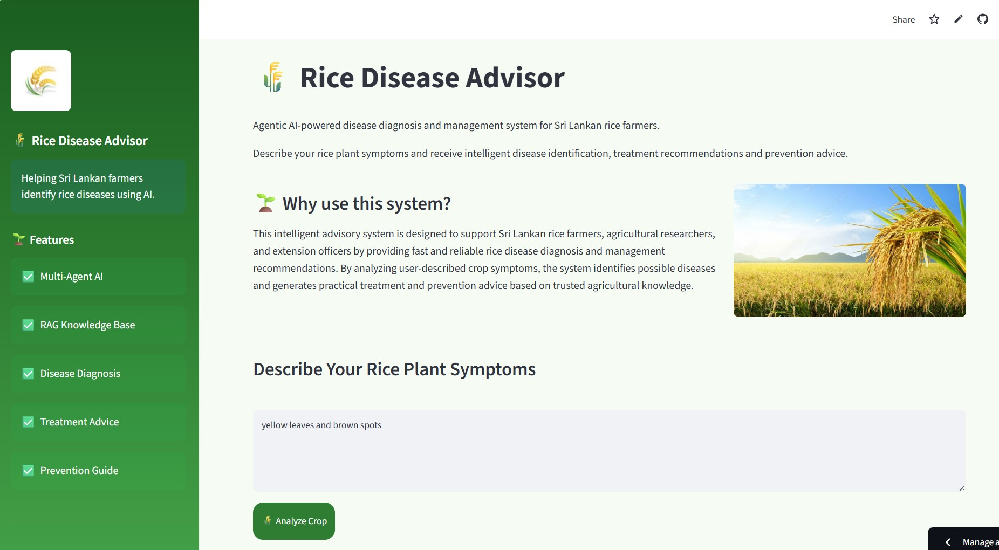
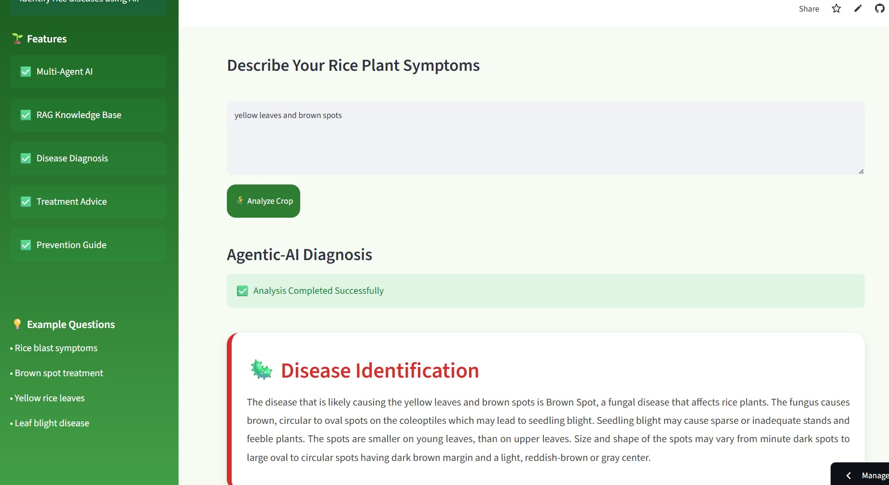
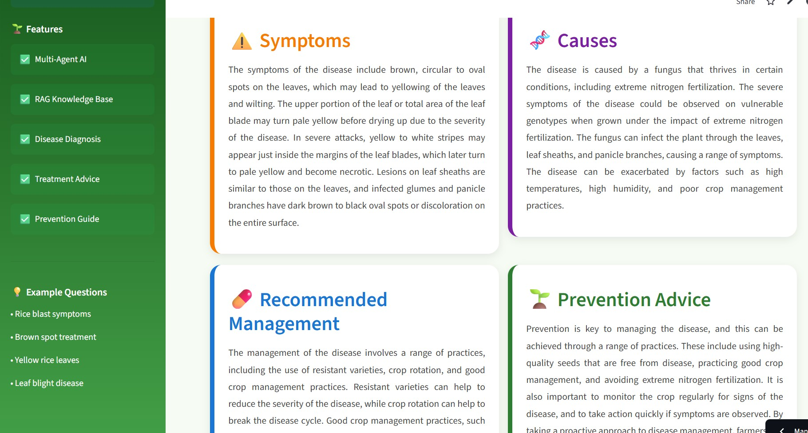
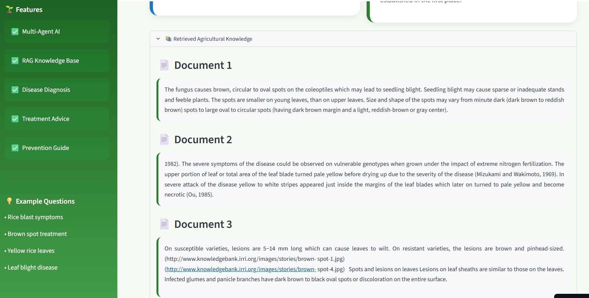
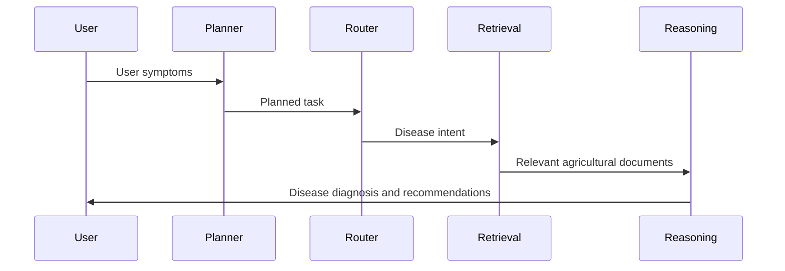

# Agentic AI-Powered Oryza sativa (Rice) Disease Advisory System

An intelligent multi-agent decision support system developed to assist **Sri Lankan rice farmers, agricultural researchers, and agricultural extension officers** in identifying rice diseases and receiving evidence-based management recommendations.

The system combines **Agentic Artificial Intelligence**, **Retrieval-Augmented Generation (RAG)**, **Large Language Models (LLMs)**, and **Streamlit** to provide accurate, explainable, and context-aware disease diagnosis and advisory services.

Unlike a traditional chatbot, this project uses multiple AI agents that collaborate to understand the user's question, retrieve relevant agricultural knowledge, reason over the information, and generate practical recommendations.

# Project Overview

Rice (*Oryza sativa*) is one of the most important food crops in Sri Lanka. Every year, rice production is affected by fungal, bacterial, viral diseases, nutrient deficiencies, and environmental stress. Many farmers struggle to correctly identify diseases during the early stages, leading to reduced yield and unnecessary pesticide use.

This project was developed to provide an intelligent advisory system capable of assisting users throughout the disease diagnosis process.

The application allows users to:

- Describe rice plant symptoms using natural language
- Upload field observations
- Retrieve information from a domain-specific agricultural knowledge base
- Identify possible rice diseases
- Explain the reasoning behind the prediction
- Recommend disease management practices
- Suggest preventive measures
- Provide responses using multiple collaborating AI agents

The application demonstrates the practical use of **Agentic AI** in agriculture while fulfilling the requirements of the IT41043 Intelligent Systems project.

## Live Demo

 **Launch the application:**  
https://ricediseaseadvisor-mq2ycv67nbysbcjnqydczp.streamlit.app/

# Objectives

The main objectives of this project are:

- Develop an Agentic AI system capable of diagnosing rice diseases.
- Demonstrate communication between multiple AI agents.
- Integrate Retrieval-Augmented Generation (RAG) with agricultural documents.
- Improve response quality using domain-specific knowledge.
- Provide understandable recommendations for farmers.
- Compare different language models for different reasoning tasks.
- Deploy the complete application on Streamlit Community Cloud.

# Target Users

This system is designed for:

-  Rice Farmers
-  Agricultural Researchers
-  Agricultural Extension Officers
-  Agriculture Students
-  Government Agriculture Departments

#  Key Features

- Multi-Agent AI Architecture
- Intelligent Task Planning
- Intent Routing
- Retrieval-Augmented Generation (RAG)
- Domain-Specific Knowledge Base
- Rice Disease Diagnosis
- Disease Management Recommendations
- Prevention Guidelines
- Streamlit Web Application
- Fast LLM Inference using Groq/OpenRouter
- Explainable AI Responses
- Modular Agent Design
- Easily Extendable Knowledge Base

# Application Screenshots

<table align="center">
<tr>

<td align="center">
<br>
<b>Home Page</b>
</td>

<td align="center">
<br>
<b>Disease Diagnosis</b>
</td>

<td align="center">
<br>
<b>Agent Workflow</b>
</td>

<td align="center">
<br>
<b>Final Recommendation</b>
</td>

</tr>
</table>

#  Technologies Used

| Category | Technology |
|-----------|------------|
| Programming Language | Python 3.11 |
| Frontend | Streamlit |
| Agent Framework | LangGraph |
| LLM Provider | Groq / OpenRouter |
| Embedding Model | sentence-transformers/all-MiniLM-L6-v2 |
| Vector Database | FAISS |
| Knowledge Retrieval | LangChain |
| PDF Processing | PyPDF |
| Version Control | Git & GitHub |
| Deployment | Streamlit Community Cloud |

# System Architecture

The Rice Disease Advisor follows a modular **Agentic AI architecture**, where multiple intelligent agents collaborate to solve a user's query. Instead of relying on a single large language model for every task, the system divides the problem into smaller subtasks. Each agent is responsible for a specific function such as planning, routing, knowledge retrieval, or reasoning.

This architecture improves scalability, response quality, and maintainability while demonstrating how multiple AI agents can cooperate to solve real-world agricultural problems.

# Main Components

## 1. Streamlit User Interface

The Streamlit application provides a simple web interface where users can:

- Enter disease symptoms
- Submit questions
- View disease predictions
- Read management recommendations
- Explore prevention methods

The interface communicates directly with the Agentic AI workflow.

## 2. Planner Agent

The Planner Agent acts as the coordinator of the system.

Its responsibilities include:

- Understanding the user's request
- Initial task planning
- Preparing information for downstream agents
- Creating structured messages

This agent ensures that every request follows the correct execution pipeline.

## 3. Router Agent

The Router Agent determines the user's intent before expensive reasoning is performed.

Possible intents include:

- Disease Identification
- Disease Information
- Disease Management
- Disease Prevention
- General Rice Information

Using a lightweight language model for routing reduces both latency and computational cost

## 4. Retrieval Agent

The Retrieval Agent connects the language model with the agricultural knowledge base.

Responsibilities include:

- Query preprocessing
- Semantic search
- Retrieving relevant document chunks
- Passing retrieved context to the Reasoning Agent

Instead of relying only on model memory, the system retrieves verified agricultural information from curated documents.

## 5. Reasoning Agent

The Reasoning Agent is responsible for generating the final response.

It combines:

- User symptoms
- Retrieved agricultural knowledge
- Disease reasoning
- Language model capabilities

The final response includes:

- Predicted disease
- Explanation
- Symptoms
- Possible causes
- Management recommendations
- Prevention methods

## 6. FAISS Vector Database

The vector database stores document embeddings generated during the ingestion process.

During user queries, FAISS performs fast similarity searches to identify the most relevant document chunks.

Advantages include:

- Fast retrieval
- Efficient semantic search
- Lightweight implementation
- Works offline after indexing


# Agentic AI Design Patterns

A key objective of this project is to demonstrate how multiple AI agents can collaborate instead of relying on a single language model. The system follows several Agentic AI design patterns to improve reasoning quality, modularity, and scalability.

The following design patterns are implemented in this project.

## 1. Planning / Task Decomposition Pattern

### Purpose

The Planning pattern is responsible for understanding the user's request and breaking it into smaller tasks before execution.

Instead of immediately sending the user's prompt to the language model, the Planner Agent first prepares a structured workflow.

### Responsibilities

- Analyse user input
- Create execution plan
- Prepare structured message
- Pass information to the next agent

### Source Code

```
agents/
└── planner_agent.py
```

### Example

User Input

```
My rice leaves have brown circular spots with yellow edges.
```

Planner Output

```python
{
    "task": "Disease Diagnosis",
    "requires_retrieval": True,
    "priority": "High"
}
```

This information is then forwarded to the Router Agent.

## 2. Router Pattern

### Purpose

Not every user question requires deep reasoning.

The Router Agent first identifies the user's intent using a lightweight language model.

This reduces response time and avoids unnecessary computation.

### Possible Intents

- Disease Identification
- Disease Information
- Disease Prevention
- Disease Management
- General Rice Questions

### Source Code

```
agents/
└── router_agent.py
```

### Example

Input

```
How can I prevent Rice Blast?
```

Router Output

```json
{
    "intent": "Disease Prevention"
}
```

The request is then sent to the Retrieval Agent.

## 3. Tool Use Pattern (Retrieval-Augmented Generation)

### Purpose

Large Language Models may produce outdated or hallucinated information.

To improve reliability, the system retrieves information from a domain-specific agricultural knowledge base before generating a response.

The Retrieval Agent acts as a tool that searches the FAISS vector database.

### Source Code

```
agents/
└── retrieval_agent.py

rag/
├── ingest.py
├── retrieve.py
└── vectorstore/
```

### Retrieval Process

```
User Question

↓

Convert Question to Embedding

↓

Semantic Similarity Search

↓

Retrieve Top-k Documents

↓

Send Context to Reasoning Agent
```

### Example Code

```python
docs = vectorstore.similarity_search(query, k=4)

context = "\n\n".join(
    doc.page_content for doc in docs
)
```

The retrieved context becomes additional knowledge for the language model.

## 4. Reasoning Pattern

### Purpose

The Reasoning Agent combines:

- User symptoms
- Retrieved documents
- Agricultural knowledge
- LLM reasoning

to generate the final diagnosis.

### Source Code

```
agents/
└── reasoning_agent.py
```

The final response includes:

- Disease Name
- Symptoms
- Causes
- Management
- Prevention

# Summary of Agentic Design Patterns

| Pattern | Purpose | Code Location |
|----------|----------|--------------|
| Planning | Task decomposition | `agents/planner_agent.py` |
| Router | Intent classification | `agents/router_agent.py` |
| Tool Use (RAG) | Retrieve agricultural knowledge | `agents/retrieval_agent.py` |
| Reasoning | Final diagnosis and advisory | `agents/reasoning_agent.py` |

These patterns allow the system to behave as a collaborative multi-agent AI application rather than a single chatbot.

#  Agent-to-Agent Communication

Instead of one AI model handling everything, the application uses structured communication between multiple agents.

Each agent receives a structured message, performs its assigned task, updates the message, and forwards it to the next agent.

This modular design makes the workflow easier to maintain and extend.

## Communication Workflow



## Message Flow

The communication pipeline is:

```
User

↓

Planner Agent

↓

Router Agent

↓

Retrieval Agent

↓

Reasoning Agent

↓

Final Response
```

## Structured Message Format

Each agent exchanges structured information using a shared message format.

Example:

```python
message = {
    "sender": "Planner Agent",
    "receiver": "Router Agent",
    "task": "Disease Diagnosis",
    "query": user_query,
    "intent": None,
    "context": None,
    "response": None
}
```

The Router Agent updates the message.

```python
message["intent"] = "Disease Identification"
```

The Retrieval Agent appends the retrieved context.

```python
message["context"] = retrieved_documents
```

Finally, the Reasoning Agent generates the response.

```python
message["response"] = final_answer
```

## Example Communication

### Step 1

User enters:

```
Brown spots appeared on rice leaves.
```

Planner Agent

```json
{
    "task":"Disease Diagnosis"
}
```

↓

Router Agent

```json
{
    "intent":"Disease Identification"
}
```

↓

Retrieval Agent

```json
{
    "documents":[
        "Brown Spot",
        "Rice Blast"
    ]
}
```

↓

Reasoning Agent

```json
{
    "disease":"Brown Spot",
    "management":"Apply balanced fertilizer and recommended fungicide."
}
```

↓

Displayed to the user through the Streamlit interface.

## Benefits of Multi-Agent Communication

- Clear separation of responsibilities
- Easy debugging
- Better maintainability
- Lower inference cost
- Faster response time
- Supports future expansion
- Demonstrates Agentic AI principles required by the project

# Model Selection Strategy

This project uses **multiple Large Language Models (LLMs)** instead of relying on a single model for every task. Different tasks require different levels of reasoning, speed, and computational cost.

A lightweight model is used for simple routing tasks, while a more powerful model is used for disease diagnosis and recommendation generation.

This approach reduces latency and improves the overall performance of the application.

## Why Multiple Models?

The application performs several different tasks:

- Understanding the user's question
- Classifying the user's intent
- Retrieving relevant agricultural knowledge
- Generating disease diagnosis
- Producing management recommendations

Using one large model for every step would increase both cost and response time. Therefore, the system selects the most suitable model for each task.

## Model Comparison

| Sub-task | Model | Provider | Why Selected |
|----------|---------|----------|--------------|
| Intent Classification | Llama 3.1 8B Instant | Groq | Extremely fast, low latency, ideal for routing simple user requests. |
| Disease Diagnosis & Reasoning | Llama 3.3 70B Versatile | Groq | Better reasoning ability for analysing symptoms and generating detailed recommendations. |
| Knowledge Retrieval | FAISS + MiniLM Embeddings | Local | Fast semantic search without repeatedly querying an LLM. |

## Model Selection Justification

| Feature | Llama 3.1 8B Instant | Llama 3.3 70B Versatile |
|----------|----------------------|--------------------------|
| Provider | Groq | Groq |
| Latency | Very Low | Moderate |
| Cost per Token | Low | Higher |
| Context Window | Large | Large |
| Reasoning Quality | Good | Excellent |
| Best Use Case | Intent Routing | Disease Diagnosis |

## Model Configuration

The selected models are configured inside the project.

```
config/
└── models.py
```

Example configuration:

```python
ROUTER_MODEL = "llama-3.1-8b-instant"

REASONING_MODEL = "llama-3.3-70b-versatile"
```

The Router Agent uses the lightweight model.

```python
client.chat.completions.create(
    model=ROUTER_MODEL,
    messages=messages
)
```

The Reasoning Agent uses the more powerful reasoning model.

```python
client.chat.completions.create(
    model=REASONING_MODEL,
    messages=messages
)
```

This separation allows the application to remain responsive while maintaining high-quality disease recommendations.

---

# Retrieval-Augmented Generation (RAG)

Large Language Models have general knowledge but may produce outdated or incorrect agricultural advice.

To improve accuracy, this project uses **Retrieval-Augmented Generation (RAG)**.

Instead of relying only on the language model, the system retrieves information from a curated agricultural knowledge base before generating the final answer.

---

## RAG Workflow


---

## Knowledge Base

The knowledge base contains more than **20 agricultural documents** collected from trusted sources.

The documents include:

- Rice Blast
- Brown Spot
- Bacterial Leaf Blight
- Sheath Blight
- Stem Rot
- False Smut
- Leaf Scald
- Rice Tungro Disease
- Integrated Pest Management
- Rice Nutrient Deficiencies
- Fertilizer Recommendations
- Paddy Cultivation Practices
- Sri Lankan Agriculture Guidelines
- Disease Prevention Methods

These documents are stored inside:

```
data/
└── pdfs/
```

---

## Document Ingestion

The ingestion pipeline converts PDF documents into searchable vector embeddings.

The process includes:

1. Load PDF documents
2. Split text into chunks
3. Generate embeddings
4. Store embeddings in FAISS

---

Example

```python
loader = PyPDFDirectoryLoader("data/pdfs")

documents = loader.load()
```

---

## Chunking Strategy

Large PDF files are divided into smaller chunks before indexing.

Configuration:

```python
RecursiveCharacterTextSplitter(
    chunk_size=500,
    chunk_overlap=100
)
```

### Why?

Smaller chunks improve retrieval accuracy because the retrieved context contains only the most relevant information.

## Embedding Model

This project uses:

```
sentence-transformers/all-MiniLM-L6-v2
```

Advantages:

- Lightweight
- Free
- High-quality sentence embeddings
- Fast inference
- Excellent semantic similarity performance

Example

```python
embeddings = HuggingFaceEmbeddings(
    model_name="sentence-transformers/all-MiniLM-L6-v2"
)
```

## Vector Store

The project uses **FAISS** for semantic similarity search.

Benefits:

- Fast retrieval
- Lightweight
- Easy local deployment
- Excellent performance for medium-sized document collections

Example

```python
vectorstore = FAISS.from_documents(
    chunks,
    embeddings
)
```

The generated vector database is stored in:

```
rag/

└── vectorstore/
```

## Retrieval Process

When a user submits a question:

```
User Question

↓

Convert to Embedding

↓

Search FAISS

↓

Retrieve Top 4 Chunks

↓

Send Context to Reasoning Agent
```

Example

```python
docs = vectorstore.similarity_search(
    query,
    k=4
)
```

# Retrieval Evaluation

To evaluate the effectiveness of the retrieval system, five sample queries were tested.

| Query | Retrieved Context | Relevant? |
|--------|------------------|-----------|
| Brown circular spots on leaves | Brown Spot Disease Guide | ✅ Yes |
| Diamond-shaped lesions | Rice Blast Document | ✅ Yes |
| Yellowing leaves with bacterial infection | Bacterial Leaf Blight | ✅ Yes |
| White fungal growth around stem | Sheath Blight Guide | ✅ Yes |
| Prevent blast disease | Disease Prevention Guide | ✅ Yes |

## Evaluation Summary

The retrieval results demonstrated that the FAISS vector database consistently returned relevant document chunks for disease-related queries.

Using retrieved agricultural documents significantly improved the quality of responses generated by the Reasoning Agent compared to relying solely on the language model.

The combination of semantic search and domain-specific knowledge reduced hallucinations and provided recommendations that were better aligned with established agricultural practices.

# Installation Guide

## 1. Clone the Repository

```bash
git clone https://github.com/YOUR_GITHUB_USERNAME/RiceDiseaseAdvisor.git

cd RiceDiseaseAdvisor
```

## 2. Create a Virtual Environment

### Using Conda

```bash
conda create -n rice_agent_ai python=3.11

conda activate rice_agent_ai
```


### Or Using Python venv

```bash
python -m venv venv

venv\Scripts\activate
```

## 3. Install Dependencies

```bash
pip install -r requirements.txt
```

## 4. Configure API Keys

Create a `.env` file in the project root.

```
OPENROUTER_API_KEY=your_openrouter_api_key

GROQ_API_KEY=your_groq_api_key
```

Example

```python
import os
from dotenv import load_dotenv

load_dotenv()

groq_key = os.getenv("GROQ_API_KEY")
```

## 5. Build the Vector Database

Run the ingestion pipeline before starting the application.

```bash
python rag/ingest.py
```

Expected output

```
Loading PDF documents...

Splitting documents...

Creating embeddings...

Saving FAISS vector database...

Completed Successfully.
```

# Running the Application

Start the Streamlit application.

```bash
streamlit run app.py
```

The application will be available at

```
http://localhost:8501
```

# Example Queries

Example 1

```
Brown circular spots with yellow margins on rice leaves.
```

Expected Disease

```
Brown Spot
```

---

Example 2

```
Diamond-shaped lesions on rice leaves.
```

Expected Disease

```
Rice Blast
```

---

Example 3

```
How can I prevent bacterial leaf blight?
```

Expected Output

```
Disease prevention recommendations.
```

# Streamlit Deployment

The application is deployed using **Streamlit Community Cloud**.

Deployment steps:

1. Push the project to GitHub.
2. Open Streamlit Community Cloud.
3. Sign in using GitHub.
4. Select the repository.
5. Select the `main` branch.
6. Choose `app.py` as the main file.
7. Click **Deploy**.

After deployment, the application becomes publicly accessible.

Example

```
https://your-app-name.streamlit.app
```

# Secrets Management

Sensitive information such as API keys is **never committed to GitHub**.

For local development, API keys are stored inside a `.env` file.

For Streamlit deployment, the same keys are stored using **Streamlit Secrets**.

Example

```toml
OPENROUTER_API_KEY="your_key"

GROQ_API_KEY="your_key"
```

The application reads these values securely at runtime.

This prevents accidental exposure of confidential credentials.

# Acknowledgements

The successful completion of this project was made possible with the support of several open-source communities and organizations.

# References

1. International Rice Research Institute (IRRI). https://www.irri.org

2. Food and Agriculture Organization (FAO). https://www.fao.org

3. LangChain Documentation. https://python.langchain.com

4. LangGraph Documentation. https://langchain-ai.github.io/langgraph

5. Groq Documentation. https://console.groq.com/docs

6. OpenRouter Documentation. https://openrouter.ai/docs

7. Hugging Face Sentence Transformers. https://www.sbert.net

8. FAISS Documentation. https://github.com/facebookresearch/faiss

9. Streamlit Documentation. https://docs.streamlit.io

10. Python Documentation. https://docs.python.org

